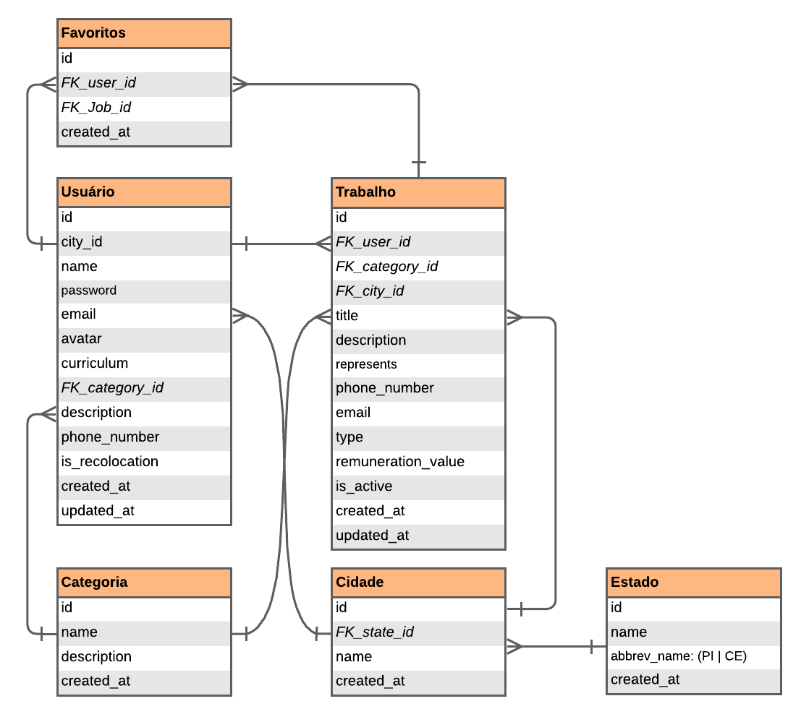

### ER Model


### Inicializando

```sh
$ yarn
$ docker-compose up -d --build
```

### Verificando instâncias geradas

```sh
$ docker-compose ps #Verifica os status dos containers levantados
$ docker logs jobfinder-api -f #Verifica logs da API no docker
$ docker logs jobfinder-db -f #Verifica logs do DB no docker
```

### Criando Migration

```sh
$ yarn typeorm migration:create -n nome_da_migration

```

### Gerando uma Migration baseada em entidade do TypeORM

```sh
$ yarn typeorm migration:generate -n nome_da_migration #Criar uma entidade baseada no typeORM antes

```

### Rodando Migration

```sh
$ yarn typeorm migration:run

```
